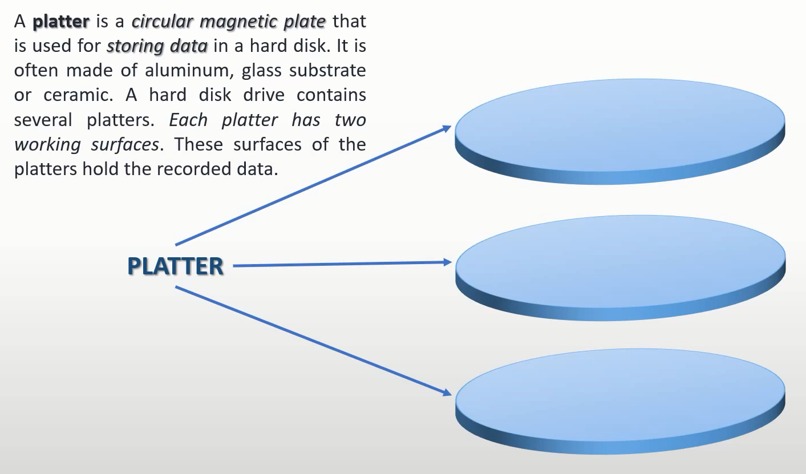
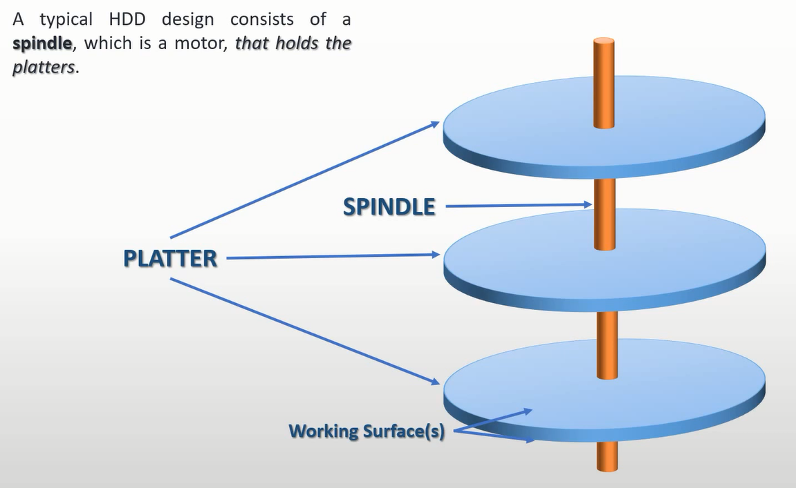
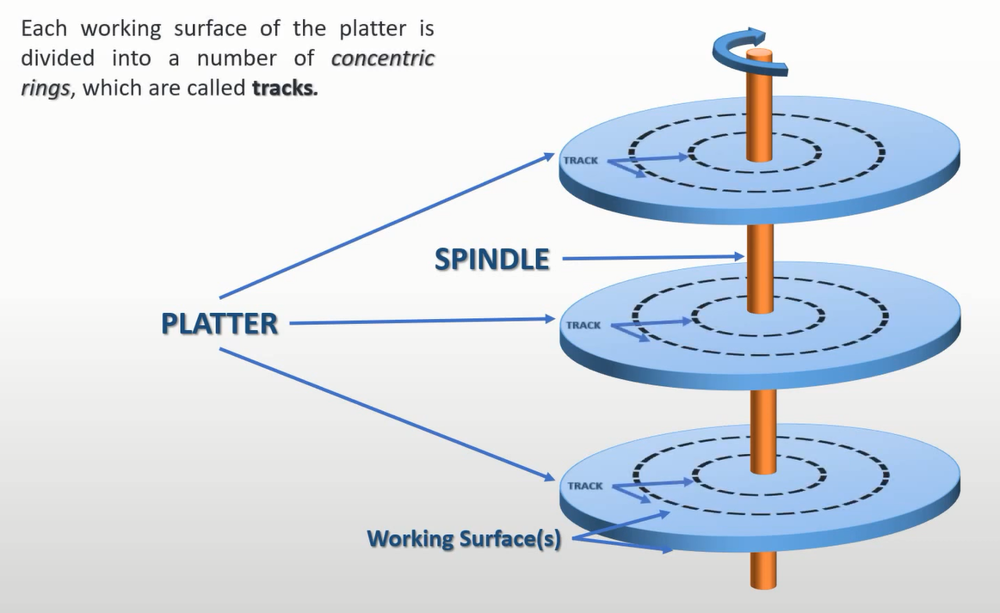
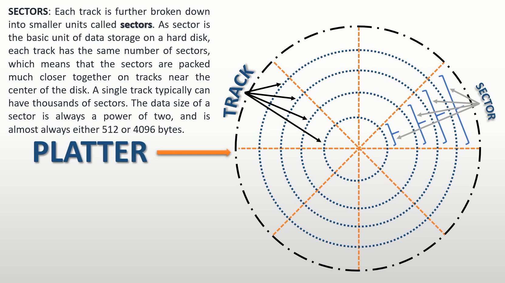

# 硬盘读写

## 硬盘

---

---

---

---

---

---

----

- 扇区：是硬盘读写的最小单位，最小一个，最多 256 个扇区
- 机械臂的寻道时间是硬盘性能的主要瓶颈；
- 一般情况下一个磁道有 63 个扇区，主要是由于 BIOS 最大支持这么多；
- 磁道从外侧计数，所以一般情况下 C 盘的读写速度最快；

## IDE / ATA PIO Mode

Port Input Output 端口输出输出模式

端口是外部设备内部的寄存器；

- IDE：Integrated Drive Electronics 集成电子驱动器 / 西部数据
- ATA：Advanced Technology Attachment  / American National Standards Institute ANSI 美国国家保准学会
- SATA / PATA

## 硬盘读写

- CHS 模式 / Cylinder / Head / Sector
- LBA 模式 / Logical Block Address

LBA28，总共能访问 128G 的磁盘空间；

硬盘控制端口

| Primary 通道            | Secondary 通道 | in 操作      | out 操作     |
| ----------------------- | -------------- | ------------ | ------------ |
| 0x1F0                   | 0x170          | Data         | Data         |
| 0x1F1                   | 0x171          | Error        | Features     |
| 0x1F2                   | 0x172          | Sector count | Sector count |
| 0x1F3                   | 0x173          | LBA low      | LBA low      |
| 0x1F4                   | 0x174          | LBA mid      | LBA mid      |
| 0x1F5                   | 0x175          | LBA high     | LBA high     |
| 0x1F6                   | 0x176          | Device       | Device       |
| 0x1F7                   | 0x177          | Status       | Command      |

- 0x1F0：16bit 端口，用于读写数据
- 0x1F1：检测前一个指令的错误
- 0x1F2：读写扇区的数量
- 0x1F3：起始扇区的 0 ~ 7 位
- 0x1F4：起始扇区的 8 ~ 15 位
- 0x1F5：起始扇区的 16 ~ 23 位
- 0x1F6:
    - 0 ~ 3：起始扇区的 24 ~ 27 位
    - 4: 0 主盘, 1 从片
    - 6: 0 CHS, 1 LBA
    - 5 ~ 7：固定为1
- 0x1F7: out
    - 0xEC: 识别硬盘
    - 0x20: 读硬盘
    - 0x30: 写硬盘
- 0x1F7: in / 8bit
    - 0 ERR
    - 3 DRQ 数据准备完毕
    - 7 BSY 硬盘繁忙

## 参考文献

- <https://www.youtube.com/watch?v=oEORcCQ62nQ>
- <https://wiki.osdev.org/ATA_PIO_Mode>
- <https://bochs.sourceforge.io/techspec/PORTS.LST>
- <https://www.techtarget.com/searchstorage/definition/IDE>

